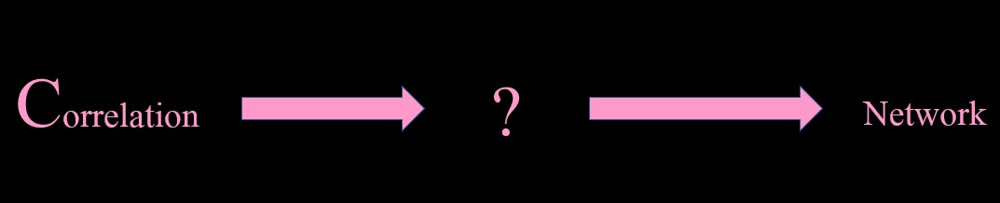

class: center, middle
```{r theme, include = FALSE, warning = FALSE}
library(xaringanthemer)
library(showtext)
style_mono_accent_inverse(
  base_color = "#FF99CC",
  header_font_google = google_font("Old Standard TT"),
  text_font_google   = google_font("Old Standard TT"),
  code_font_google   = google_font("Old Standard TT")
)

```
<style>

.center-left {
  position:          relative;
  top:               50%;
  transform:         translateY(50%);
}
.center-right {
  position:          relative;
  top:               50%;
  transform:         translateY(10%);
}

</style>


# Introduction to networks


---
#Network examples

.pull-left[.center-left[

```{r network_graph_code, eval = FALSE, warning = FALSE}
library(qgraph)
con_nonnorm_data <- read.csv("D:\\Lindley Backup\\Thesis\\data\\Condition_NonNorm\\140-4-3-4-cnonnorm.csv", header 
                  = TRUE, stringsAsFactors = FALSE)
con_nonnormal_corr <- read.csv("D:\\Lindley Backup\\Thesis\\data\\Condition_CorNonnormal\\140-4-3-4-cor_non.csv",
                  header = TRUE, stringsAsFactors = FALSE)
rownames(con_nonnormal_corr) <- colnames(con_nonnormal_corr)
con_Graph_lasso <- qgraph(con_nonnormal_corr, graph = "glasso", 
                  layout = "spring", sampleSize =
                  nrow(con_nonnorm_data))
      
```
]]

.pull-right[.center-right[
```{r network_graph_code-out, ref.label="network_graph_code", echo=FALSE, warning = FALSE, message = FALSE}
```
]]
---
class: center, middle



---

class: center, middle


---

class: center, middle

#The robustness of EBIC glasso to distributional misspecification


---
#Simulation


.pull-left[
```{r true_val, eval = FALSE, warning = FALSE}
  for(a in 1:length(nodes)){
    for(b in 1:length(percentages)){
    pcor_net <- ggm.simulate.pcor(nodes[a], 
                                etaA = percentages[b],
                                stdprec=FALSE)
    cor_net <- round(pcor2cor(pcor_net), 6)
    norm_data <- mvrnorm(100000, mu = rep(0, nodes[a]), Sigma = cor_net)
    nonnorm_data <- exp(norm_data)
    cov_nonnorm <- cov(nonnorm_data)
    mean_nonnorm <- colMeans(nonnorm_data)
    npn.transformed <- huge.npn(nonnorm_data)
    cor.npn <- cor(npn.transformed)
    Graph_lasso <- qgraph(cor.npn, graph = "glasso", layout =    
                            "spring",
                          sampleSize = nrow(nonnorm_data))
    centralitymeasures <- centrality(Graph_lasso) 
    graph <- as.igraph(Graph_lasso)
    e_central <- eigen_centrality(graph, directed = FALSE, scale =
                                    TRUE,
                  weights = NULL, options = arpack_defaults)}}
 
```

]

.pull-right[
-	Simulate true values and parameters
-	For true values
  1.	Generate partial correlation matrix
  2.	Derive correlation matrix and generated normal data
  3.	Exponentiate the normal data 
  4.	Do a nonparanormal transformation
  5.	Derive the correlation matrix
  6.	Run EBIC glasso to get a network
  7.	Get measures of network structure
-	For parameters
  1.	Take a sample of the partial correlation matrix
  2.	Run rest of true value code except don’t do a nonparanormal transformation

]

---
#Measures

-_Centrality measures_ give us local and global information about the graph.

--

-_Standardized bias_ tells us if centrality measures are over or underestimated.

--

-a_multilevel metamodel_ tells us the relationship between the conditions (number of nodes, percentage of connection, and sample size) and our estimates.

--

.footnote[
-We limited our sample to those that did not have a standard devaiation of zero and had a standardized bias between -100 and 100.


-We also limited our assessment to those points that were the minimum distance from the minimum, maximum, and mean of the true values.]

---
class: center, middle
#Results: Percentage .4 for mean 

```{r result_graph, echo = FALSE, warning = FALSE, message = FALSE}
selection <- read.csv("D:\\Lindley Backup\\Thesis\\selection.csv", header = TRUE)
###Make graph of standardized bias
###Label facets
n.labs <- c("Sample size 274", "Sample size 802",
            "Sample size 2654", "Sample size 34653")
names(n.labs) <- c(274, 802, 2654, 34653)
file.labs <- c("Degree", "Betweenness", "Closeness", "Eigenvector")
names(file.labs) <- c("degree", "between", "close", "eigen")

library(tidyverse)


###Graph for mean
selection %>%
  filter(con_per == 0.4 & use.this.mean == 1) %>%
  ggplot(aes(x= factor(con_nodes, levels=c('7', '12', '20', '36', '57')), y = stnd_bias, fill = con_nodes)) +
  geom_col() +
  facet_wrap(~con_n + file_name, labeller = labeller(con_n = n.labs, file_name = file.labs)) +
  labs(x = "Number of nodes", y = "Standardized bias") +
  ylim(-35, 30)

```

---

#Results: MLM

-_Degree_: Nodes x Percentage interaction


-_Betweenness_: Main effects of nodes and sample size and Nodes x Sample size interaction


-_Closeness_: Main effects of nodes, percentage, and sample size and Interactions of Nodes x Sample Size and Percentage x Sample size (for mean and maximum)


-_Eigenvector_: None significant

---
#Conclusion

-Utilizing EBIC glasso with nonnormal data results in underestimating true values.

-Future research should concentrate on assessing the adequacy of the use of nonparanormal transformation, diversifying centrality measures, and assessing nonnormality generality, not particular conditions under nonnormality.

---
#Thank you!

.pull-left[
 
]

.pull-right[

]